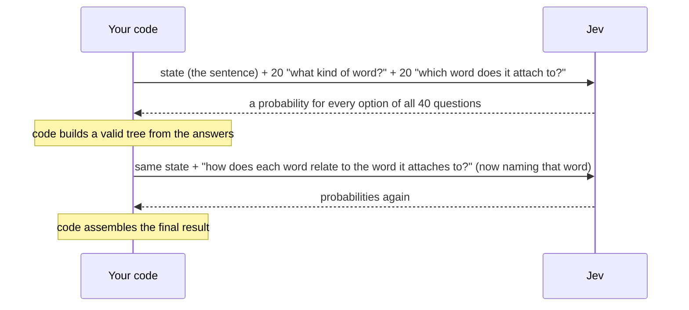
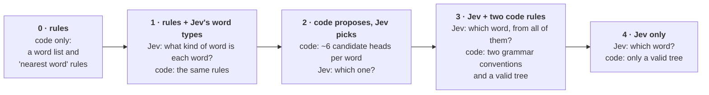
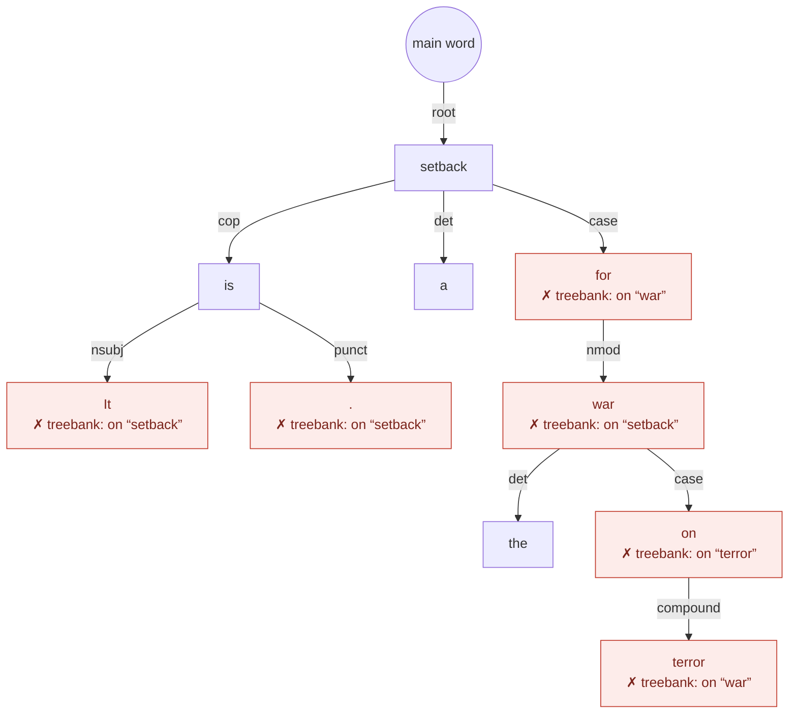
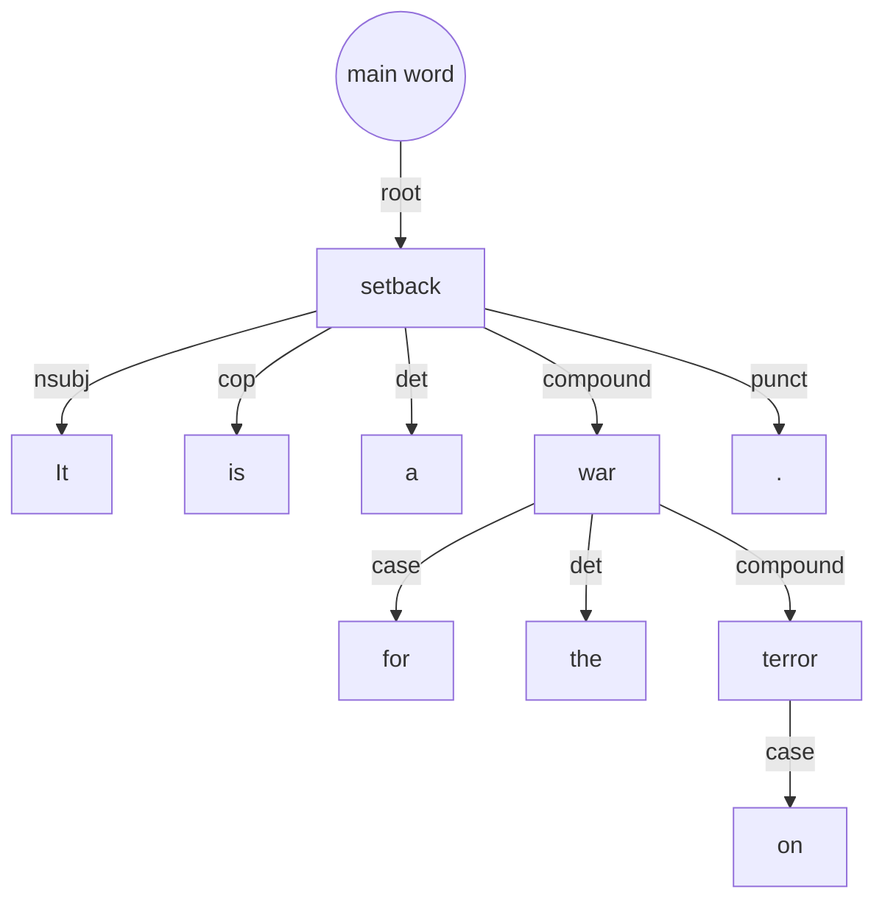
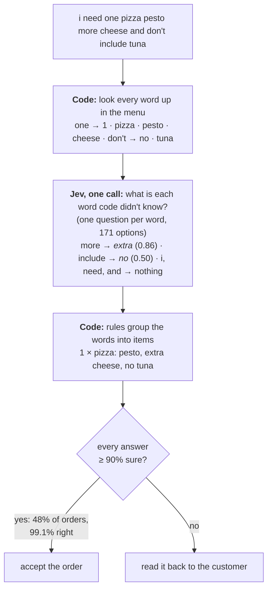
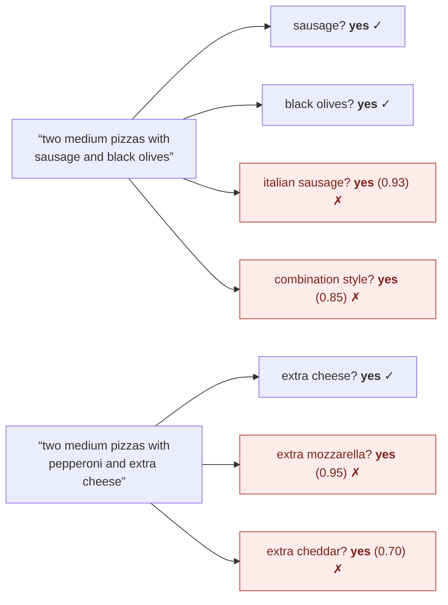

# system-one-parsers

**What happens when you ask a System One model thousands of small questions instead of one big
one?** This repo finds out on two jobs with public answer keys: drawing the grammar tree of a
sentence, and turning a pizza order into a structured order. Along the way it measures which ways
of asking work, and which don't.

The model is [Jev](https://docs.typesafe.ai) from TypeSafe AI. You give it some state and a batch
of closed questions (pick one option, yes/no, or a score), and it returns a probability for every
answer. There's no LLM and no trained parser here: every judgment about the text comes from Jev's
answers, and plain code turns them into a result.

Everything is reproducible: the code, the questions, the scoring, and a cache of every answer Jev
gave. The full numbers, methods and caveats are in **[the detailed report](docs/report.md)**.

## The short version

Eight lessons, each backed by a measurement (the report has the intervals, the tests, and which
data each one comes from):

1. **Let code handle structure; ask Jev to classify.** Jev sorts things into categories very
   well: word types 92% right, relationship names 85–90%, menu items ~99%. It's much weaker at
   "which of these 30 words does this one connect to?" (50%). The best setups give Jev the
   classifying and give code the structure.
2. **The wording of the question is the biggest lever.** Taking the grammar conventions out of
   one question cost 10.5 points. Rewording the pizza topping questions from "does the customer
   want olives?" to "does the customer *name* olives? don't infer it" took whole orders from 8% to
   69% right.
3. **Many independent yes/no questions multiply small errors.** One question per topping, 108 per
   pizza, each right 95–99% of the time, got 8% of orders fully right.
4. **One flat list beats a two-step menu, even at 171 options.** Asking "what kind of thing, then
   which one" lost to a single list of every option, both at 17 options and at 171.
5. **Remove impossible options in code; don't ask code to guess the likely ones.** Taking options
   code *knows* can't be right out of a question gained 10 points. Having code propose a shortlist
   of likely answers did no better than letting Jev choose from everything, because the shortlist
   sometimes missed the right one.
6. **Pack independent questions into one call; ask a follow-up when an earlier answer helps.**
   Asking the same questions alone or bundled with 20 others changed the top answer 1% of the time.
   Asking how two words relate *after* knowing they're linked beat asking up front by 2.4 points.
7. **Confident answers can be trusted.** When Jev was at least 90% sure, it was right 95–99% of the
   time on category questions. On pizza orders (code first, Jev filling gaps), the 48% of orders where
   every answer was that sure were 99.1% right.
8. **Check what plain code gets first.** On the pizza benchmark, the menu's own word lists plus
   about 150 lines of rules got 93.3% of orders right, well above both systems in the dataset's
   paper. Jev added 1.8 points on top, to 95.1%.

## How Jev is used here

A job is a few **calls**. Each call sends the state once, plus every question that can be asked at
that point. Jev answers each question independently: one question never sees another's answer
([TypeSafe docs](https://docs.typesafe.ai/primitives.md)). So everything that doesn't depend on an
earlier answer goes in the same call, and code runs between calls.



This is one question from a parse of "The dog chased a red ball across the yard." (trimmed: the
full instructions also spell out the treebank's conventions):

```json
"head_w9": {
  "type": "choice",
  "instructions": "In `sentence`, which word is the head of `words.w9`, the word that `words.w9` attaches to as a modifier, argument or function word? …",
  "criteria": {
    "w1": "`words.w1` (\"The\", the first word)",
    "w7": "`words.w7` (\"across\", after \"ball\")",
    "…": "one option per other word",
    "root": "None: `words.w9` is the main word (predicate) of the whole sentence."
  }
}
```

And Jev's answer, from a recorded run:

```json
"head_w9": { "choice": "w7", "confidence": 0.87,
             "probabilities": { "w7": 0.89, "w3": 0.05, "w8": 0.04, "w10": 0.01, "root": 0.01, "…": "…" } }
```

`bun run explain "Your sentence."` shows every call like this: each question as sent, each answer
as returned, what code did in between, and the result.

## Experiment 1: drawing a sentence's grammar tree

**The task.** In a dependency tree, every word attaches to one other word: "red" to "ball", "ball"
to "chased". The answer key is [UD English EWT](https://github.com/UniversalDependencies/UD_English-EWT),
sentences from blogs, emails, reviews and forums that linguists annotated by hand. The score is
**attached right**: the share of words attached to the same word as in the answer key.

**The ladder.** The same job, with Jev doing more and more of it:



**Results** on 125 test sentences (2,524 words) that none of these designs was tuned on:

| Rung | Design | Attached right | | $ per 1,000 sentences |
| --- | --- | --- | --- | --- |
| 0 | rules (code only) | 41.7% | `████████▍` | 0 |
| 1 | rules + Jev's word types | 55.2% | `███████████` | 0.53 |
| 2 | code proposes, Jev picks | 52.3% | `██████████▌` | 2.54 |
| **3** | **Jev + two code rules** | **65.7%** | `█████████████▏` | 3.15 |
| 4 | Jev only | 51.1% | `██████████▎` | 3.15 |

- **Jev alone (51%) does worse than simple rules fed Jev's word types (55%).** Jev often hangs a
  word off a little word ("war" off "for", "It" off "is"); the answer key's convention does the
  opposite. One code rule, "little words can't be heads", built on Jev's own word types, fixes most
  of it. With a second rule, the parse gets to 65.7%, 24 points above code alone.
- **Code proposing candidates didn't help.** Jev picked the right one 57% of the time, and the
  shortlist missed the right answer for 12% of words.
- **Short and near is easy, long and far is hard.** Rung 3 attaches a word right 86% of the time
  when the answer is its neighbor, and 30% when it's 5 or more words away.

The same sentence through rungs 4 and 3. Red boxes are words attached differently from the answer
key:



Rung 4, Jev only: 4 of 10 words attached right. Jev's answers put "It" on "is" and "war" on "for",
the way school grammar does. With the two code rules (rung 3), all 10 are attached right:



(This sentence was picked because the rules fix everything in it. On average they fix about 15
points' worth of words per sentence.)

**Question-design experiments** (one change at a time, on 125 dev sentences, attachment only):

| Change to the "which word?" question | Effect on attached right |
| --- | --- |
| Leave out the grammar conventions in the instructions | **−10.5 points** |
| Code removes impossible options (little words) before asking | **+10.2** |
| Add each word's neighbors to the shared state | **−7.1** |
| Ask word types as a two-step menu (3 groups, then the type) | word types 89.1% vs 92.0% with one list |
| Reverse the option order, or ask twice in both orders | no measurable difference |

A design that split the job into smaller phrase questions ("are these two neighbors in the same
phrase?", "which direction is the head?") scored *below* Jev alone (43.5% vs 51.1%): the weak
early answers (direction was right 42% of the time) carried into later calls.

For scale: a 2025 benchmark of open LLMs asked to parse EWT without training found the best one
(Llama 3.1 70B) at 39.7% attached right ([Better Benchmarking LLMs for Zero-Shot Dependency Parsing](https://arxiv.org/html/2502.20866v1));
trained parsers reach 86–95%. The setups differ, so these aren't head-to-head comparisons.

## Experiment 2: taking pizza orders

**The task.** Amazon's [PIZZA benchmark](https://github.com/amazon-science/pizza-semantic-parsing-dataset):
1,357 test orders written by people, like "i need one pizza pesto more cheese and don't include
tuna", each with the right answer as a structured order. The dataset comes with its menu: ~85
toppings, 23 styles, 22 drinks, sizes, and the words customers use for each. An order only counts
if *everything* in it is right. The dataset's paper reports 68.0% for its grammar-based parser and
78.6% for its best model, trained on 2.46 million synthetic orders
([Arkoudas et al. 2022](https://arxiv.org/abs/2212.00265)).

**Results** on the 1,357 test orders (designs were built on the 348 dev orders):

| Design | What Jev does | Whole order right | | $ per 1,000 orders |
| --- | --- | --- | --- | --- |
| The paper's grammar parser | — | 68.0% | `█████████████▋` | — |
| The paper's best trained model | — | 78.6% | `███████████████▊` | — |
| **Code only:** menu word lists + rules | nothing | 93.3% | `██████████████████▋` | 0 |
| **Code first, Jev fills gaps** | labels the words the lists don't know | **95.1%** | `███████████████████` | 1.40 |
| **Jev labels every word** | one question per word, 171 options | **95.1%** | `███████████████████` | 2.93 |
| One question per topping (best wording) | answers ~19 menu questions per order | 73.2% | `██████████████▋` | 0.20 |

The winning design: code does what it's sure of, Jev handles the words code doesn't know, and code
puts the order together. Jev's answers also say when the order can be trusted:



Both Jev designs beat code alone by a margin chance doesn't explain: code first, Jev fills gaps
fixed 39 orders and broke 14. The things Jev added are what word lists miss: "more cheese" and
"double cheese" (extra), "coca-colas", "jalepenos", "shaved parmasean", "xl", "i'll pass on the
peppers". With perfect
answers, the rules that group the words would top out at 95.2% on these orders, so the remaining
errors are almost all in the code, not in Jev's answers.

**The trap: one yes/no question per menu item.** A common Jev pattern is to ask, for each item on
the menu, "did the customer ask for this?" With 85 toppings and 23 styles, that's 108 questions per
pizza. Each was right 95–99% of the time, yet only **8%** of orders came out fully right. Almost
every mistake was Jev saying yes to something *related* to what was said:



(Two items from one dev order, with Jev's probability for each wrong "yes".)

On the 348 dev orders:

| Version | Whole order right |
| --- | --- |
| "Does the customer want olives on this item?" | 8.3% |
| "Does the customer *name* olives? It counts only if they say it; don't infer it", with notes like "plain 'olives' is a different entry" on green olives | 69.0% |
| The same, but code only asks about toppings that share a word with the item (19 questions instead of 108) | 74.7% |

The wording fixed most of it, but this design still trails code alone by 20 points. Its
"confident" orders are also less trustworthy (93% right rather than 99%). The lesson: when an
answer is built from dozens of independent questions, each must be nearly perfect, so ask fewer,
better-worded questions.

## Try it

```sh
bun install
bun test                                    # offline unit tests

# Experiment 1: parsing
bun run fetch-ud                            # the treebank (CC BY-SA 4.0), downloaded and checked
bun run explain "The dog chased a red ball across the yard."
bun run eval                                # the report card, from the answer cache
bun run eval --client record --split test   # call Jev for anything not cached

# Experiment 2: pizza orders
bun run fetch-pizza                         # the PIZZA orders and menu (CC BY-NC 4.0)
bun run pizza:explain "two large pizzas with extra cheese and a diet coke"
bun run pizza --client record --split test
```

Calls to Jev need `TYPESAFE_API_KEY` in `.env`; every answer is cached, so re-running is free. At
TypeSafe's listed price of $0.042 per million input tokens, the most expensive design here costs
about $4 per 1,000 sentences. [`docs/evals.md`](docs/evals.md) explains every option and column of
the parser report card, and [`examples/pizza/README.md`](examples/pizza/README.md) the pizza one.

## What's where

```
src/question-sets/     the parser's questions, one file per kind of question
src/strategies/        the parser designs: the ladder, the phrase designs, the experiments
src/votes.ts           combining attachment answers; the tree builder
src/calls.ts           sends calls, splits big ones, records every question and answer
examples/pizza/        the pizza designs, questions, rules, report card and explain
eval/                  the parser's explain, report card and scoring
docs/report.md         the detailed report: every number, method and caveat
docs/evals.md          how to run and read the parser evals
baselines/             a script that runs a trained parser (Stanza) on the same sentences
```

## Caveats

- One model version (jev-1.13.0), English only, and samples of 125 sentences and 1,357 orders. The
  report gives 95% intervals and paired tests for every comparison above.
- The parser designs and the pizza rules were developed on dev data; the headline numbers come from
  test data that was run once at the end. The question-design experiments are on dev data.
- The answer keys follow their own conventions (which word counts as the head; whether "hamburger"
  means beef). Some "mistakes" are disagreements about convention.

## License

MIT for the code. The data is downloaded at run time, not included: UD English EWT is CC BY-SA
4.0, and the PIZZA benchmark is CC BY-NC 4.0 (non-commercial). The idea of parsing with closed
questions generalizes Stately's [jevspresso](https://github.com/statelyai/jevspresso) demo; no
code is copied from it.
