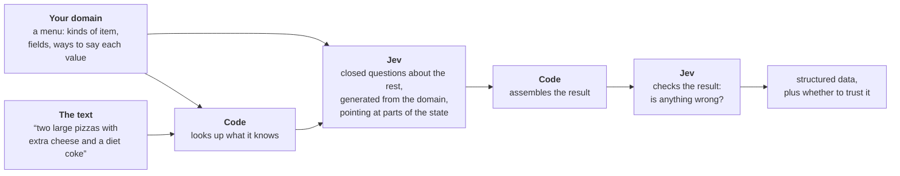

# question-kit

**How far can you get turning what people say into structured data for your code, using a System
One model and plain code, with no second LLM?**

> **Active research.** This repo is in a prototype phase: the packages here are early, and their
> APIs will change as the research goes on. If you're interested in using them, or have a use case
> you think they'd fit, please open an issue and tell us; feedback is what we're after right now.

[Jev](https://docs.typesafe.ai), TypeSafe AI's System One model, doesn't write text. You send it
some state and a batch of closed questions ("which of these options?", "yes or no?"), and it
returns a probability for every option. It's a classifier. The work here is about how to turn a
task like taking an order into the right classification questions, and how code and Jev's answers
fit together around them.

## The pattern

Every design that worked here has the same shape:



The questions point at named parts of the state (`words.w3`, `summary.i1`) and offer every option
the domain allows, each described ("Topping: green peppers; not the same as peppers"). Writing
those by hand is tedious and easy to get wrong. The goal of question-kit's **core** is to generate
them from your domain and state.

## Packages

question-kit is one repo with a package per job: `core`, which generates the questions, and kits
for particular uses, side by side. The kits will build on `core`; today there is only `order-kit`.
Each is its own package under the `@question-kit` scope, and none is published yet.

### `order-kit` (prototype)

Takes an order in one message, for any menu you describe:

```ts
import { defineMenu, takeOrder } from "@question-kit/order-kit";

const cafe = defineMenu({
  name: "coffee",
  place: "a coffee counter",
  items: { drink: {}, pastry: {} },
  fields: {
    drink:  { items: ["drink"], names: true, values: { LATTE: ["latte", "lattes"], AMERICANO: ["americano"] } },
    size:   { items: ["drink"], values: { SMALL: ["small"], LARGE: ["large", "big"] } },
    milk:   { items: ["drink"], values: { OAT: ["oat", "oat milk"], WHOLE: ["whole milk"] } },
    extras: { items: ["drink"], many: true, amounts: true, values: { SHOT: ["shot", "espresso shot"], FOAM: ["foam"] } },
    pastry: { items: ["pastry"], names: true, values: { CROISSANT: ["croissant", "croissants"] } },
  },
});

const order = await takeOrder("a large oat latte with an extra shot and no foam and two croissants", cafe, jev);

order.readBack;  // ["1 large oat latte with extra shot and no foam", "2 croissants"]
order.accept;    // true when every check answer says the order is probably right
order.confirm;   // otherwise, which items to read back, and whether to ask "anything else?"
```

`jev` is any client with a `systemOne(request)` method; the
[package README](packages/order-kit/README.md) shows one for TypeSafe's SDK, and every option.

**How it was measured.** The design comes from the experiments in [`research/`](research/README.md).
With the menu of Amazon's [PIZZA benchmark](https://github.com/amazon-science/pizza-semantic-parsing-dataset),
it got 95.1% of 1,357 test orders exactly right (the benchmark paper's best trained model: 78.6%),
for about $1.43 per 1,000 orders. Its check accepted 75.7% of orders without a read-back, and 7 of
the 66 wrong orders were among them. That's one benchmark of single-message pizza orders, in
English, with jev-1.13; other menus haven't been measured. The [pizza example](examples/order-kit/pizza/README.md)
runs it on the benchmark.

## Model support

For now, question-kit works with Jev only. We haven't compared decision models ourselves, but
published comparisons suggest Jev's probabilities are among the better calibrated (one
[study](https://arxiv.org/abs/2610.06625) found them better calibrated than GPT-6 Luna's token
probabilities, though not consistently better than an open-weight Qwen model's). We want to measure how each model does, and
find the best way to generate questions for whichever one you choose.

## What we found

Designed from measured experiments; the [research write-up](research/README.md) has the details and
the [report](research/report.md) every number.

- **Let code handle structure; ask Jev to classify.** Jev labels words against a 171-option menu
  ~99% right, but picks "which of ~35 words does this one attach to" only half the time.
- **Code first, Jev for the gaps.** The menu's word lists plus rules got 93.3% of pizza orders
  right; asking Jev only about the words they didn't know took it to 95.1%.
- **Wording and examples matter most.** Rewording one design's questions took it from 8% to 69%
  of orders right; adding examples to each option took it from 73.2% to 84.5%.
- **Many yes/no questions multiply small errors.** 108 questions per pizza, each 95–99% right,
  gave 8% of orders fully right.
- **Have Jev check the finished result.** Reading the order back to Jev, one question per item and
  one for "anything missing?", is what decides when to accept an order.

## What's next

More kits, and the `core` they'll share. We'll add them here once they've been measured.

## Try it

```sh
bun install
bun test                                  # offline unit tests
bun run fetch-pizza                       # the PIZZA orders and menu (CC BY-NC 4.0, downloaded, not included)
bun run order:pizza "two large pizzas with extra cheese and no onions and a diet coke"
```

Calls to Jev need `TYPESAFE_API_KEY` in `.env`; answers are cached, so re-running is free.

## What's where

```
packages/     the packages: order-kit, so far
examples/     things built with them: a pizza order taker, measured on the PIZZA benchmark
research/     the experiments, the write-up, and the detailed report
```

## Contributing

Issues are the best way in right now: questions, use cases, and places where the order taker gets
things wrong. We're not looking for feature pull requests yet; if you have an idea, open an issue
to discuss it first. Pull requests that fix a problem you hit in a real use case are welcome.

## License

MIT for the code. Datasets are downloaded at run time and keep their own licenses: UD English EWT
(CC BY-SA 4.0) and the PIZZA benchmark (CC BY-NC 4.0, non-commercial). The idea of parsing and
taking orders with closed questions builds on Stately's [jevspresso](https://github.com/statelyai/jevspresso)
demo; no code is copied from it.
