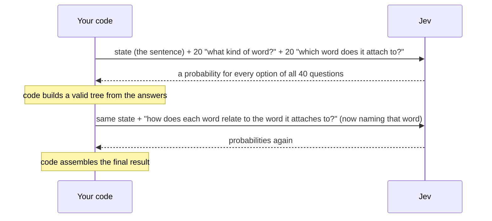
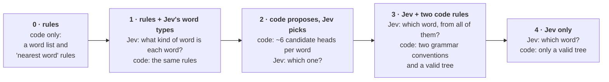
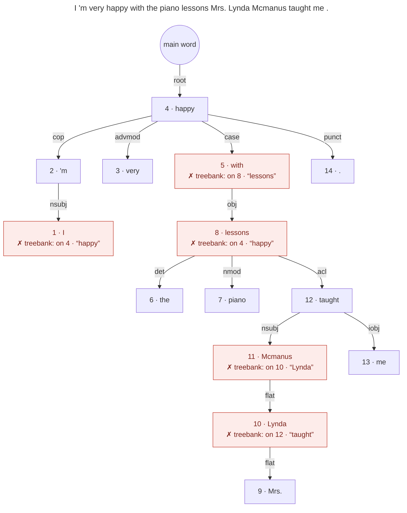
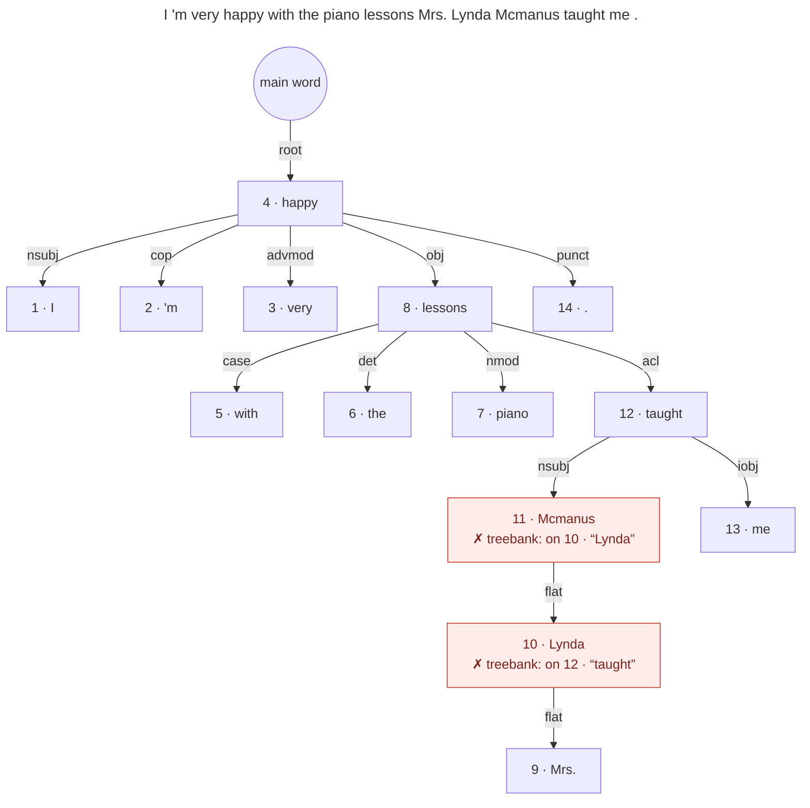
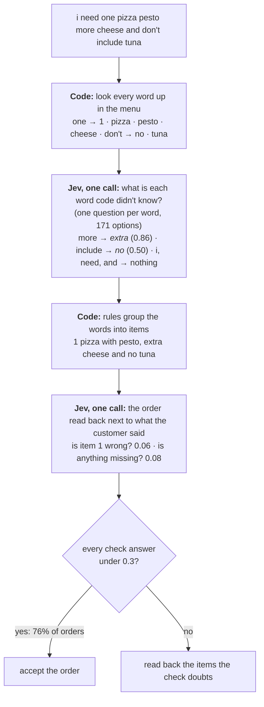
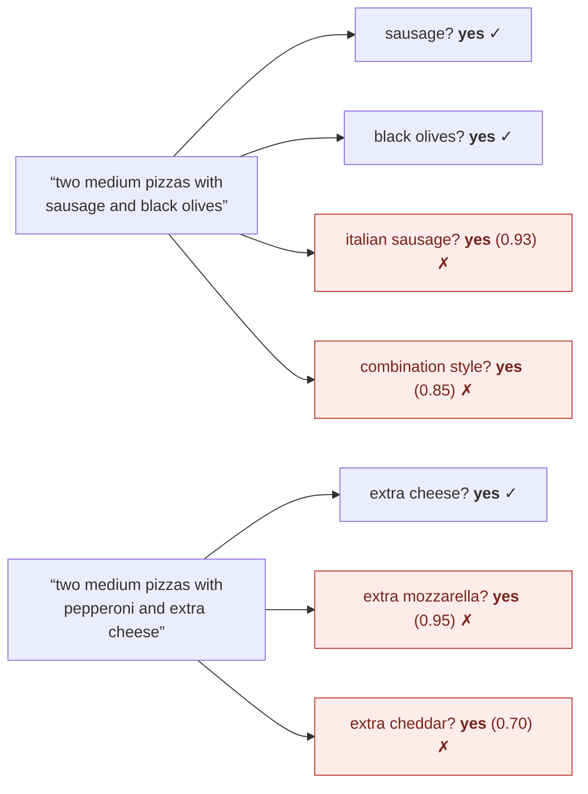

# Research: Jev and plain code, measured

The experiments behind [question-kit](../README.md). **Can a model that only answers
multiple-choice questions take a pizza order, or diagram a sentence?** We built both out of
[Jev](https://docs.typesafe.ai), TypeSafe AI's System One model, and measured them on public answer
keys. What worked became the [order taker](../packages/order-kit/README.md); what we learned about
asking Jev questions is what question-kit is meant to package.

Jev doesn't write text. You send it some state (here, a customer's order or a sentence) and a batch
of closed questions ("which of these options?", "yes or no?"), and it returns a probability for
every option. A job here takes one to four rounds of questions, each sending every question that
can be asked at that point, from a handful to a few hundred. Plain code turns the answers into the
result. There's no LLM and no trained parser.

The part you can use is an order taker, [`packages/order-kit`](../packages/order-kit/README.md). Give it a
menu, and it turns "two large pizzas with extra cheese and a diet coke" into a structured order and
says whether to accept the order or read it back to the customer first. On Amazon's PIZZA
benchmark it gets **95.1%** of 1,357 test orders exactly right (the benchmark paper's best trained
model: 78.6%), for about $1.43 per 1,000 orders.

Everything is reproducible: the code, the questions, the scoring, and a cache of every answer Jev
gave. The full numbers, methods and caveats are in **[the detailed report](report.md)**. This is
active research: designs and numbers will change as we run more experiments.

## The Jev dial

Each design here is a setting on a dial: how much of the job Jev does, from **0** (all code, no
Jev) to **4** (Jev does nearly everything; code only assembles its answers). The question running
through both experiments is where to set it. The answer: in the middle. Code does what it's sure of
and holds the structure together; Jev classifies what code can't, and checks the result.

## The short version

Ten lessons, each backed by a measurement (the report has the intervals, the tests, and which data
each one comes from):

1. **Let code handle structure; ask Jev to classify.** Jev sorts things into categories very
   well: word types 92% right, relationship names 85–90%, menu items ~99%. It's much weaker at
   "which of these ~35 words does this one connect to?" (50%). The best designs give Jev the
   classifying and give code the structure.
2. **The wording of the question is the biggest lever.** Taking the grammar conventions out of
   one question cost 10.5 points. Rewording the pizza topping questions from "does the customer
   want olives?" to "does the customer *name* olives? don't infer it" took whole orders from 8% to
   69% right. Adding examples to each answer option ("extra olives", "hold the olives") took the
   same design from 73.2% to 84.5% on test.
3. **Many independent yes/no questions multiply small errors.** One question per topping, 108 per
   pizza, each right 95–99% of the time, got 8% of orders fully right.
4. **One flat list beats a two-step menu, even at 171 options.** Asking "what kind of thing, then
   which one" lost to a single list of every option, both at 17 options and at 171.
5. **Remove impossible options in code; don't ask code to guess the likely ones.** Taking options
   code *knows* can't be right out of a question gained 10 points. Having code propose a shortlist
   of likely answers did no better than letting Jev choose from everything, because the shortlist
   sometimes missed the right one.
6. **Pack independent questions into one call; ask a follow-up when an earlier answer helps.**
   Asking the same questions alone or bundled with 20 others changed the top answer 1% of the time.
   Asking how two words relate *after* knowing they're linked beat asking up front by 2.4 points.
7. **A follow-up has to add something.** Asking a word again with only the few options Jev was
   torn between made orders *worse* (95.1% → 89.2% right): with fewer options, Jev started
   answering for the words around it ("drinks" in "no drinks" became "no", and the "cheese" in
   "extra cheese" became "extra").
8. **Confident answers can be trusted.** When Jev was at least 90% sure, it was right 95–99% of the
   time on category questions. Taking pizza orders with code first and Jev filling gaps, the 48% of
   orders where every answer was that sure were 99.1% right.
9. **Have Jev check the finished result.** Reading the order back to Jev ("is this item wrong? is
   anything missing?") let the order taker accept 76% of orders as they were, with 7 of the 66
   wrong orders slipping through. Accepting only the orders where Jev was sure of every word took
   48%, with 6 slipping through. One question per item caught more wrong orders than one question
   about the whole order.
10. **Check what plain code gets first.** On the pizza benchmark, the menu's own word lists plus
    about 150 lines of rules got 93.3% of orders right, well above both systems in the dataset's
    paper. Jev added 1.8 points (95.1%). Running two Jev designs and having Jev pick when they
    disagree added 1.2 more (96.3%), at three times the cost.

## How Jev is used here

A job is a few **calls**. Each call sends the state once, plus every question that can be asked at
that point. Jev answers each question independently: one question never sees another's answer
([TypeSafe docs](https://docs.typesafe.ai/primitives.md)). So everything that doesn't depend on an
earlier answer goes in the same call, and code runs between calls.



This is one question from a parse of "The dog chased a red ball across the yard." (trimmed: the
full instructions also spell out the treebank's conventions):

```json
"head_w9": {
  "type": "choice",
  "instructions": "In `sentence`, which word is the head of `words.w9`, the word that `words.w9` attaches to as a modifier, argument or function word? …",
  "criteria": {
    "w1": "`words.w1` (\"The\", the first word)",
    "w7": "`words.w7` (\"across\", after \"ball\")",
    "…": "one option per other word",
    "root": "None: `words.w9` is the main word (predicate) of the whole sentence."
  }
}
```

And Jev's answer, from a recorded run:

```json
"head_w9": { "choice": "w7", "confidence": 0.87,
             "probabilities": { "w7": 0.89, "w3": 0.05, "w8": 0.04, "w10": 0.01, "root": 0.01, "…": "…" } }
```

`bun run explain "Your sentence."` shows every call like this: each question as sent, each answer
as returned, what code did in between, and the result.

## Experiment 1: drawing a sentence's grammar tree

**The task.** In a dependency tree, every word attaches to one other word: "red" to "ball", "ball"
to "chased". The answer key is [UD English EWT](https://github.com/UniversalDependencies/UD_English-EWT),
sentences from blogs, emails, reviews and forums that linguists annotated by hand. The score is
**attached right**: the share of words attached to the same word as in the answer key.

**The Jev dial**, from all code to all Jev:



**Results** on 125 test sentences (2,524 words) that none of these designs was tuned on:

| Jev dial | Design | Attached right | | $ per 1,000 sentences |
| --- | --- | --- | --- | --- |
| 0 | rules (code only) | 41.7% | `████████▍` | 0 |
| 1 | rules + Jev's word types | 55.2% | `███████████` | 0.53 |
| 2 | code proposes, Jev picks | 52.3% | `██████████▌` | 2.54 |
| **3** | **Jev + two code rules** | **65.7%** | `█████████████▏` | 3.15 |
| 4 | Jev only | 51.1% | `██████████▎` | 3.15 |

- **Jev alone (51%) does worse than simple rules fed Jev's word types (55%).** Jev often hangs a
  word off a little word (a noun off the preposition before it, a subject off "is"); the answer
  key's convention does the opposite. One code rule, "little words can't be heads", built on Jev's
  own word types, fixes most of it. With a second rule, the parse gets to 65.7%, 24 points above
  code alone.
- **Code proposing candidates didn't help.** Jev picked the right one 57% of the time, and the
  shortlist missed the right answer for 12% of words.
- **Short and near is easy, long and far is hard.** Dial 3 attaches a word right 86% of the time
  when the answer is its neighbor, and 30% when it's 5 or more words away.

The same sentence through dials 4 and 3: "I'm very happy with the piano lessons Mrs. Lynda
Mcmanus taught me." (a review from the treebank, outside the scored samples). Each box shows the
word's position; red boxes are words attached differently from the answer key, with where the
answer key attaches them.



Dial 4, Jev only: 9 of 14 words attached right. Jev's answers put "I" on "'m" and "lessons" on
"with", the way school grammar does; the answer key's convention makes content words the heads.
With the two code rules (dial 3), 12 of 14 are right:



The two words left are a convention about names: the answer key makes the first word of a name its
head ("Lynda"), and Jev picked the last ("Mcmanus"). (This sentence was picked from five about
music and art because it shows the rules' fixes most clearly. Across the scored test sentences, the
rules add 14.6 points.)

**Question-design experiments** (one change at a time, on 125 dev sentences, attachment only):

| Change to the "which word?" question | Effect on attached right |
| --- | --- |
| Leave out the grammar conventions in the instructions | **−10.5 points** |
| Code removes impossible options (little words) before asking | **+10.2** |
| Add each word's neighbors to the shared state | **−7.1** |
| Ask word types as a two-step menu (3 groups, then the type) | word types 89.1% vs 92.0% with one list |
| Reverse the option order, or ask twice in both orders | no measurable difference |

A design that split the job into smaller phrase questions ("are these two neighbors in the same
phrase?", "which direction is the head?") scored *below* Jev alone (43.5% vs 51.1%): the weak
early answers (direction was right 42% of the time) carried into later calls.

For scale: a 2025 benchmark of open LLMs asked to parse EWT without training found the best one
(Llama 3.1 70B) at 39.7% attached right ([Better Benchmarking LLMs for Zero-Shot Dependency Parsing](https://arxiv.org/html/2502.20866v1));
trained parsers reach 86–95%. The setups differ, so these aren't head-to-head comparisons.

## Experiment 2: taking pizza orders

**The task.** Amazon's [PIZZA benchmark](https://github.com/amazon-science/pizza-semantic-parsing-dataset):
1,357 test orders written by people, like "i need one pizza pesto more cheese and don't include
tuna", each with the right answer as a structured order. The dataset comes with its menu: ~85
toppings, 23 styles, 22 drinks, sizes, and the words customers use for each. An order only counts
if *everything* in it is right. The dataset's paper reports 68.0% for its grammar-based parser and
78.6% for its best model, trained on 2.46 million synthetic orders
([Arkoudas et al. 2022](https://arxiv.org/abs/2212.00265)).

**Results** on the 1,357 test orders (designs were built on the 348 dev orders):

| Jev dial | Design | What Jev does | Whole order right | | $ per 1,000 orders |
| --- | --- | --- | --- | --- | --- |
| | The paper's grammar parser | — | 68.0% | `█████████████▋` | — |
| | The paper's best trained model | — | 78.6% | `███████████████▊` | — |
| 0 | **Code only:** menu word lists + rules | nothing | 93.3% | `██████████████████▋` | 0 |
| 1 | **Code first, Jev fills gaps** | labels the words the lists don't know | **95.1%** | `███████████████████` | 1.40 |
| 3 | **Jev labels every word** | one question per word, 171 options | **95.1%** | `███████████████████` | 2.93 |
| 1 + 3 | **Both, and Jev picks when they differ** | the two above, plus "which order did the customer say?" | **96.3%** | `███████████████████▎` | 4.33 |
| 2 | One question per topping (best wording) | answers ~19 menu questions per order | 73.2% | `██████████████▋` | 0.20 |
| 2 | The same, with examples in each option | | 84.5% | `████████████████▉` | 0.30 |

The design the order taker uses by default: code does what it's sure of, Jev handles the words
code doesn't know, code puts the order together, and Jev checks it:



Code first, Jev fills gaps beats code alone by a margin chance doesn't explain: it fixed 39 orders
and broke 14. The things Jev added are what word lists miss: "more cheese" and "double cheese"
(extra), "coca-colas", "jalepenos", "shaved parmasean", "xl", "i'll pass on the peppers". With
perfect answers, the rules that group the words would top out at 95.2% on these orders, so the
remaining errors are almost all in the code, not in Jev's answers.

**Accept, or read it back?** A drive-through can't read every order back, and shouldn't accept a
wrong one. Two ways to decide, on the 1,357 test orders (code first, Jev fills gaps; 66 orders were
wrong):

| Accept the order as it is when… | Orders accepted | Wrong orders accepted |
| --- | --- | --- |
| every word Jev labeled was ≥ 90% sure | 47.7% | 6 |
| the check gives every item, and "anything missing?", P(wrong) under 0.5 | 86.8% | 15 |
| … under **0.3** (the order taker's default) | **75.7%** | **7** |
| … under 0.2 | 68.1% | 3 |

The 0.5 cut-off was set before the test run; the others were looked at afterwards, so they show
the shape of the trade-off rather than held-out results. (0.3 is where TypeSafe's
[self-consistency cookbook](https://docs.typesafe.ai/cookbooks/consistency_noul_cookbook.md) starts
its "uncertain" band.) Where the cut-off goes is a business decision: fewer read-backs, or fewer
wrong orders.

**The trap: one yes/no question per menu item.** A common Jev pattern is to ask, for each item on
the menu, "did the customer ask for this?" With 85 toppings and 23 styles, that's 108 questions per
pizza. Each was right 95–99% of the time, yet only **8%** of orders came out fully right. Almost
every mistake was Jev saying yes to something *related* to what was said:



(Two items from one dev order, with Jev's probability for each wrong "yes".)

On the 348 dev orders:

| Version | Whole order right |
| --- | --- |
| "Does the customer want olives on this item?" | 8.3% |
| "Does the customer *name* olives? It counts only if they say it; don't infer it", with notes like "plain 'olives' is a different entry" on green olives | 69.0% |
| The same, but code only asks about toppings that share a word with the item (19 questions instead of 108) | 74.7% |
| The same, with examples in each answer option ("extra olives", "hold the olives") and what it's not for | 84.5% |

Wording and examples fixed most of it, but this design still trails code alone by 9 points on
test. The lesson: when an answer is built from dozens of independent questions, each must be
nearly perfect, so ask fewer, better-worded questions.

## The order taker

[`packages/order-kit`](../packages/order-kit/README.md) packages what worked, for any menu: describe the
kinds of item you sell, their fields (size, milk, toppings…) and the ways customers say each
value, and call `takeOrder`.

```ts
import { takeOrder } from "@question-kit/order-kit";
import { pizzaMenu } from "./examples/order-kit/pizza/menu.ts";

const order = await takeOrder("i need one pizza pesto more cheese and don't include tuna", pizzaMenu(), jev);

order.readBack;  // ["1 pizza with pesto, extra cheese and no tuna"]
order.check;     // P(wrong): { whole: 0.05, items: [0.06], missing: 0.08 }
order.accept;    // true: every check answer is under 0.3
order.confirm;   // what to read back when accept is false: { items: [], missing: false }
```

The [pizza example](../examples/order-kit/pizza/README.md) builds the PIZZA menu with it and runs
it on the benchmark: it asks Jev exactly the questions measured above and gets exactly the same
results, order for order (95.1% by default, 96.3% with `design: "pick"`). Only the pizza menu has
been measured; the library's default wording for other menus is untested.

## Build your own order taker

A tutorial will come with question-kit's `core`. Until then,
[`examples/order-kit/README.md`](../examples/order-kit/README.md) has the short version, and the
[library README](../packages/order-kit/README.md) documents every option.

## Try it

```sh
bun install
bun test                                    # offline unit tests

# The order taker
bun run fetch-pizza                         # the PIZZA orders and menu (CC BY-NC 4.0)
bun run order:pizza "two large pizzas with extra cheese and no onions and a diet coke"
bun run order:pizza:verify --split test     # the order taker vs the experiment, order by order (from the cache)

# Experiment 1: parsing
bun run fetch-ud                            # the treebank (CC BY-SA 4.0), downloaded and checked
bun run explain "The dog chased a red ball across the yard."
bun run eval                                # the report card, from the answer cache
bun run eval --client record --split test   # call Jev for anything not cached

# Experiment 2: pizza orders
bun run pizza:explain "two large pizzas with extra cheese and a diet coke"
bun run pizza --client record --split test
```

Calls to Jev need `TYPESAFE_API_KEY` in `.env`; every answer is cached, so re-running is free. At
TypeSafe's listed price of $0.042 per million input tokens, the designs here cost from nothing to
about $6 per 1,000 sentences or orders. [`parsing/README.md`](parsing/README.md) explains every
option and column of the parser report card, and [`pizza/README.md`](pizza/README.md) the pizza
one.

## What's where

```
packages/order-kit/            the order taker: any menu, Jev reads and checks
examples/order-kit/            order takers built with it (pizza, measured on the benchmark)
research/lab/                  shared harness: Jev clients, the answer cache, the call log, tables
research/parsing/              experiment 1: the parser designs, its eval and explain, the Stanza baseline
  src/question-sets/           the parser's questions, one file per kind of question
  src/strategies/              the parser designs: the Jev dial, the phrase designs, the experiments
  src/votes.ts                 combining attachment answers; the tree builder
  eval/                        the parser's explain, report card and scoring
research/pizza/                experiment 2: every pizza design, the scoring, the report card
research/report.md             the detailed report: every number, method and caveat
```

## Caveats

- One model version (jev-1.13.0), English only, and samples of 125 sentences and 1,357 orders. The
  report gives 95% intervals and paired tests for every comparison above.
- The parser designs, the pizza rules and the question wording were developed on dev data; the
  headline numbers come from test data that was run once the designs were fixed. The
  question-design experiments are on dev data.
- The answer keys follow their own conventions (which word counts as the head; whether "hamburger"
  means beef). Some "mistakes" are disagreements about convention.
- Each question was asked once. How much Jev's answers change when the same request is sent again
  hasn't been measured yet.

## License

MIT for the code. The data is downloaded at run time, not included: UD English EWT is CC BY-SA
4.0, and the PIZZA benchmark is CC BY-NC 4.0 (non-commercial). The idea of parsing and taking
orders with closed questions builds on Stately's [jevspresso](https://github.com/statelyai/jevspresso)
demo; no code is copied from it.
